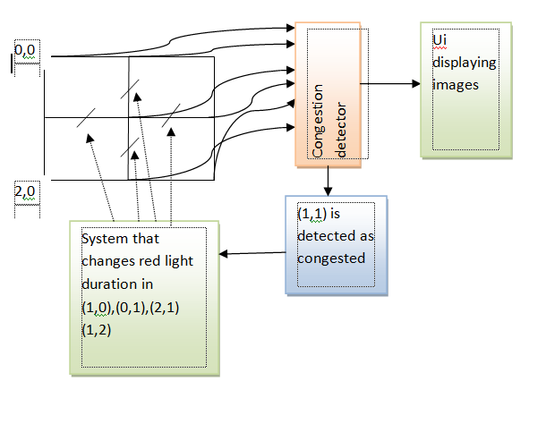

# traffic
centrally controlled traffic system ui
Smart traffic management system – saikat chakraborty,Rishav dhar, chiradeep dey BE ETCE JU.

Traffic congestion is one of the biggest problems faced by modern metropolitan cities. As of 2016 In Kolkata alone there are 740 thousand registered vehicles. Even though there is a large problem of congestion in all major cities around the world, there is no central system to control the flow of traffic. This is where we come in and propose to create a central traffic control system which runs on a pretty simple algorithm.
Each traffic crossing in a city would fall on a grid, if for example we are constantly keeping a 3×3 grid under surveillance then 9 images would come from these crossings at regular intervals of time, These 9 images are fed into a system which uses state of the art computer vision to determine the level of congestion in these crossings by various parameters like count of heavy vehicles. Now if for example we get crossing denoted by (1,1) as congested then the corresponding red light duration in the neighboring junctions increases and this inturn reduces the intake of vehicles in the congested junction and allows the vehicles in the congested junction some time to disperse.
Our product would include the entire mechanism of detection of congestion and increasing the red light duration of traffic signals in the crossings.  It would also include a ui which allows a person to constantly keep a certain number of crossings under surveillance.

   

