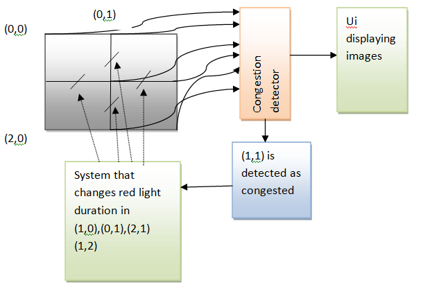

# Smart Traffic Management System
This Project presents a solution to deal with traffic congestion in metropolitan cities and presents a central traffic control system which runs on a pretty simple algorithm.
Our product would include the entire mechanism of detection of congestion and increasing the red light duration of traffic signals in the crossings.
### Directions to use this repo:
   1.Clone the github repo by running the command **git clone https://github.com/saikat021/traffic.git** or by downloading .zip\
   2.Install all the python dependencies by running **pip install -r requirements.txt**\
   3.Run the command **python main.py**\
   4.When the login page opens, enter name=admin           password=1234\
   5.The ui is up and running....
## How it Works
Each traffic crossing in a city would fall on a node, if for example we are constantly keeping a  graph (road network) under surveillance then 9 images would come from these crossings at regular intervals of time (for nodes=9).These 9 images are fed into a system which uses **state of the art computer vision to determine the level of congestion** in these crossings by various parameters like count of heavy vehicles. Now if for example we get crossing denoted by (1,1) as congested then the corresponding red light duration in the neighboring junctions increases and this inturn reduces the intake of vehicles in the congested junction and allows the vehicles in the congested junction some time to disperse.

   

## UI 
1. Since we are considering static images and not the CCTV footages, so the images get changed after every 5secs.
2. The change depicts the present crowding in the particular junction.
3. To get the location,we use Here Maps API.

### LOGIN PAGE:
   
   
   
### AT TIMEFRAME 0 SECS:

   
   
### AT TIMEFRAME 5 SECS:

   

## Technologies Used

1.YOLO Version3 for Object Detection

2.Here Maps API

3.Tkinter(Python) for UI

## Author
[Rishav Dhar](https://github.com/iamrishav111)

[Saikat Chakraborty](https://github.com/saikat021)

[Chiradeep Dey](https://github.com/chiradeepdey)
